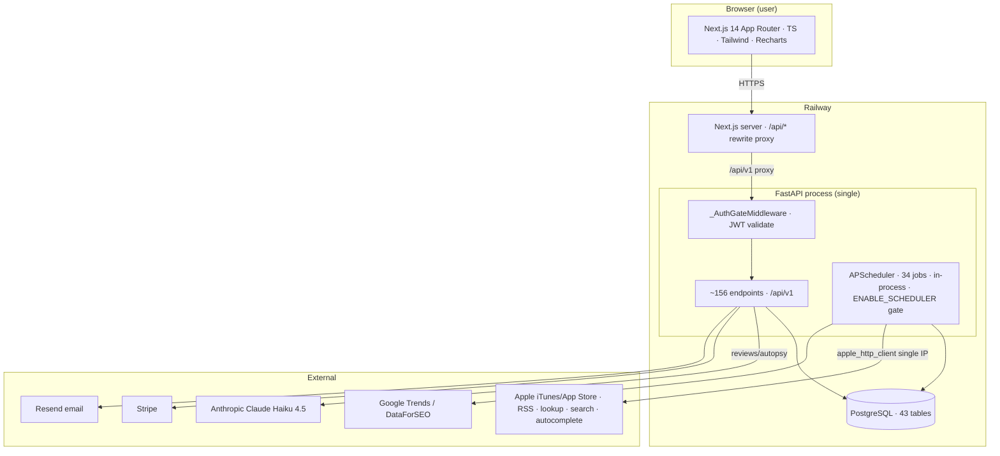

# 02 — Complete Architecture, Source Structure, Deployment & Monitoring

> Part of the **RankSpy Project Bible**. See [INDEX.md](./INDEX.md). Legend: ✅ / 🟡 / 🔴.

---

## 3. Complete Architecture

### 3.1 System context

RankSpy is a **monolithic FastAPI backend + Next.js frontend**, both deployed on **Railway**, talking to a **Railway PostgreSQL** instance and to **Apple's public iTunes/App Store endpoints** and a few third parties (Anthropic, Stripe, Resend, Google Trends, optional DataForSEO/Meta).



### 3.2 Key architectural decisions (as built)

| Decision | State | Why it matters |
|---|---|---|
| **Monolith** (one FastAPI process runs API **and** scheduler) | ✅ | Simple + cheap on Railway; but the scheduler and API share CPU/RAM/DB pool. Scaling replicas requires `ENABLE_SCHEDULER=0` on extras. |
| **Sync SQLAlchemy** (async URL stripped to psycopg2) | ✅ | The DB URL's `+asyncpg` is removed at runtime; everything is synchronous. Async scheduler jobs offload DB work to threads via `_run_in_thread_with_session`. |
| **In-process APScheduler**, single-instance via `ENABLE_SCHEDULER` | ✅ | No external queue/broker. Durable work lives in the `discovery_queue` table (Postgres), claimed with `FOR UPDATE SKIP LOCKED`. |
| **Precompute-then-read** for expensive views | ✅ | Trending, blowing-up, opportunities, metric snapshots are precomputed into tables so endpoints are cheap reads. Now per-country (composite PK). |
| **Postgres-only infra** (no Redis/Kafka) | ✅ | Queue = table + SKIP LOCKED; leader election = `ENABLE_SCHEDULER` flag; caches = in-process TTL dicts. |
| **Alembic migrations** at startup | ✅ | Recently adopted (was inline DDL). Runs `alembic upgrade head` in the FastAPI lifespan. |
| **Single egress IP** for all Apple traffic | 🟡 | The real throughput ceiling; no proxy pool. Mitigated by a 403 circuit breaker. |
| **Frontend proxies `/api/*`** via Next rewrites | ✅ | Avoids CORS; but means `request.client.host` is the proxy IP (rate limiter now reads `X-Forwarded-For`). |

### 3.3 Request lifecycle (API)
1. Browser → Next.js server → rewrite `/api/v1/*` → FastAPI.
2. `_AuthGateMiddleware` (main.py) — for `/api/v1/*` non-public paths, requires a **valid** Bearer JWT (decoded via `auth_service.decode_access_token`). ✅
3. Route dependency `get_auth_context` (deps.py) resolves `user + workspace` via a **membership join** (tenant isolation). ✅
4. Plan gating (`plan_enforcement`) for premium/usage-limited endpoints. 🟡 (usage counter race)
5. Handler → (mostly) sync ORM → response.

### 3.4 Background lifecycle (scheduler)
`main.lifespan` → `alembic upgrade head` → if `ENABLE_SCHEDULER` → `setup_scheduler()` registers 34 jobs (staggered start offsets, UTC). Planner-style jobs enqueue into `discovery_queue`; drainer jobs claim + scrape; compute jobs precompute scores. Heavy sync/HTTP work runs in worker threads that own their own DB session. See [08_SCHEDULER_WORKERS.md](./08_SCHEDULER_WORKERS.md).

---

## 4. Source Code Structure

```
appstore-spy/
├── backend/
│   ├── app/
│   │   ├── main.py                 # FastAPI app, lifespan (alembic upgrade), auth middleware, /health, /run-migrations
│   │   ├── config.py               # pydantic-settings; JWT_SECRET required in prod; ADMIN_TOKEN fail-closed
│   │   ├── config/                 # plans.py, scoring_config.py, rank_curves.py
│   │   ├── api/
│   │   │   ├── routes.py           # ~111 endpoints (4.5K+ lines) — the product surface
│   │   │   ├── auth_router.py      # register/login/verify/reset (8)
│   │   │   ├── admin_console_router.py  # superadmin console (33)
│   │   │   ├── stripe_router.py    # checkout/webhook/portal (4)
│   │   │   └── deps.py             # get_current_user / get_auth_context / get_superadmin
│   │   ├── models/
│   │   │   ├── models.py           # 43 SQLAlchemy tables
│   │   │   └── schemas.py          # Pydantic response/request models
│   │   ├── services/               # 49 domain services (scoring, keyword intel, estimators, reviews, ads, billing, email…)
│   │   ├── scrapers/               # appstore.py, app_details.py, appstore_search_scraper.py (+ apple_http_client in services)
│   │   ├── scoring/                # engine.py (2.2K lines), feature_gaps.py, ai_potential.py, idea_generator.py, weights.py
│   │   ├── workers/                # scheduler.py (34 jobs), tasks.py (ScraperWorker/ScoringWorker), discovery_engine.py
│   │   ├── jobs/                   # keyword_rank_tracker.py
│   │   ├── utils/                  # batch_utils.py (iter_batches + keyset), rate_limiter.py
│   │   └── database/__init__.py    # engine, SessionLocal, Base, get_db
│   ├── alembic/versions/           # 0001_baseline … 0005_score_country
│   ├── tests/                      # 27 test files
│   ├── requirements.txt            # prod deps (incl. alembic now)
│   ├── requirements-dev.txt        # playwright, numpy, sklearn, lxml, asyncpg (several UNUSED — see tech debt)
│   ├── Procfile / nixpacks.toml    # Railway start command
│   └── seed_data.py
├── frontend/
│   └── src/
│       ├── app/                    # 33 route dirs (rankings, trending, blowing-up, apps, keywords, competitors, …)
│       ├── components/             # 21 (AppShell, Sidebar, Header, CountrySelect, Charts, ErrorBoundary, AuthGuard…)
│       └── lib/                    # api.ts (~3045 lines), auth.tsx, utils, estimate-format
├── docs/                           # ← this Project Bible
├── AUDIT_REPORT.md / VERIFICATION_REPORT.md  # prior audit artifacts
├── COMPLIANCE_REPORT.md / PRODUCT_STRATEGY_REPORT.md
└── backend/DEPLOYMENT.md
```

**Observations:** ✅ clear layering (api → services → models). 🟡 `routes.py` (4.5K lines) and `apps/[id]/page.tsx` (3.5K lines) are oversized. 🟡 duplicated logic across services (scoring formulas, upsert copies). See [11_TECH_DEBT_DECISIONS.md](./11_TECH_DEBT_DECISIONS.md).

---

## 17. Deployment & Infrastructure

| Aspect | State | Detail (from code) |
|---|---|---|
| Platform | ✅ | **Railway**, Nixpacks builder (`nixpacks.toml`: python311 + gcc). |
| Start command | ✅ | `Procfile` / nixpacks: `uvicorn app.main:app --host 0.0.0.0 --port $PORT` (single worker). |
| Migrations | ✅ | Run in FastAPI `lifespan` via `alembic upgrade head` (programmatic). Idempotent; safe on fresh + existing DB (verified against Postgres 15). |
| Prod deps | ✅ | `requirements.txt` — fastapi, sqlalchemy 2.0, psycopg2-binary, alembic, stripe, anthropic, pytrends, resend, apscheduler, jose, bcrypt. |
| Frontend | 🟡 | Next.js `next build`; proxies `/api/*` to `BACKEND_URL`. Deployed separately (Railway service or similar). |
| **CI/CD** | 🔴 | **None.** No GitHub Actions, no automated tests/lint on push, no staging environment. |
| **Secrets** | 🟡 | Env vars (JWT_SECRET, ADMIN_TOKEN, STRIPE_*, ANTHROPIC_API_KEY, DATABASE_URL). No rotation, no secrets manager. `config.py` fails to boot without JWT_SECRET in prod ✅. |
| **Scaling** | 🟡 | Single web+scheduler process. Extra replicas require `ENABLE_SCHEDULER=0`. No worker service. |
| **Backups** | 🔴 | Relies on Railway PG defaults; not documented/verified in code. |
| **Current deploy status** | 🔴 | The `audit-fixes` branch is **unpushed and undeployed**. Production still runs old `main`. |

---

## 18. Monitoring & Logging

| Capability | State | Detail |
|---|---|---|
| Health check | ✅ | `GET /health` — verifies DB connectivity, reports scheduler state, **DB pool telemetry**, and per-job metrics (`_job_metrics`: runs/ok/fail/timeout/last_duration). |
| Structured logging | 🟡 | Python `logging` throughout with `[SCHEDULER]`, `[DISC]`, `[TRENDING_COMPUTE]` prefixes and per-job start/done/fail lines. Goes to stdout (Railway logs). |
| Job metrics accuracy | 🟡 | Jobs swallow exceptions internally then `_log_fail`, but the `_with_timeout` decorator counts `ok` unless the exception propagates — `/health` `ok` counts can overstate success for internally-caught failures. |
| **Error tracking** | 🔴 | No Sentry/Rollbar. Unhandled exceptions log + return generic 500. |
| **Metrics/dashboards** | 🔴 | No Prometheus/StatsD/Grafana. No request latency, throughput, or Apple-403 rate dashboards. |
| **Alerting** | 🔴 | No paging/alerts on job failure, migration failure, or 403 storms. |
| **Coverage/freshness metrics** | 🔴 | No instrumentation of "distinct apps by country / freshness" — the exact metric needed to prove data quality. |

**Assessment:** `/health` + logs are a reasonable start (38/100). The biggest gaps for a data product are **error tracking** and **data-coverage/freshness metrics** — without the latter you cannot see or prove data quality.
