# 05 — Database Reference (RankSpy Backend)

> **Scope.** This document describes the actual PostgreSQL schema as defined in
> `backend/app/models/models.py`, the engine/pool configuration in
> `backend/app/database/__init__.py`, and the Alembic migration chain in
> `backend/alembic/`. Everything here is derived strictly from the code on the
> `audit-fixes` branch. No behaviour is inferred beyond what the source states.
>
> **Branch context.** Migrations are now managed by **Alembic** — the old inline
> `_MIGRATIONS` list that ran ad-hoc DDL on every boot has been removed and its
> statements relocated into the `0001_baseline` revision. The **country
> dimension** was recently added: a `countries` reference table, `rankings.country`
> + `rankings.genre`, and a composite primary key `(app_id, country)` on the two
> precomputed score tables.

Legend: ✅ Implemented · 🟡 Partially Implemented · 🔴 Planned

---

## 1. Overview — Engine, Pool & Session

Source: `backend/app/database/__init__.py`.

RankSpy uses **synchronous SQLAlchemy 2.0** over **psycopg2** (the standard
sync PostgreSQL driver). The configured `database_url` may carry an `+asyncpg`
suffix (a historical artifact); it is **stripped at engine creation** so the sync
driver is always used:

```python
engine = create_engine(
    settings.database_url.replace("+asyncpg", ""),
    ...
)
```

The same `.replace('+asyncpg', '')` normalization is applied in
`alembic/env.py` so migrations and the app talk to the identical URL/driver.

### Engine (`create_engine`) — exact values

| Parameter | Value | Purpose (from code comments) |
|---|---|---|
| `pool_size` | `20` | Persistent connections. Comment: *"was 10 — needs headroom for 32 jobs + API"*. |
| `max_overflow` | `30` | Burst capacity. Comment: *"total max = 50"*. |
| `pool_timeout` | `30` | Wait up to 30 s for a free connection. |
| `pool_recycle` | `1800` | Recycle connections every 30 min (*"Railway closes idle"*). |
| `pool_pre_ping` | `True` | Verify a connection is alive before handing it out. |
| `echo` | `settings.debug` | SQL echo mirrors the app debug flag. |
| `connect_args` | `{"options": "-c statement_timeout=60000"}` | **60 s** server-side statement timeout per query (*"was 30s"*). |

**Effective ceiling:** `pool_size (20) + max_overflow (30) = 50` connections per
process. ✅ Implemented.

### Session (`sessionmaker`)

```python
SessionLocal = sessionmaker(autocommit=False, autoflush=False, bind=engine)
```

| Setting | Value | Note |
|---|---|---|
| `autocommit` | `False` | Explicit transaction control. |
| `autoflush` | `False` | No implicit flush before queries — flushes are manual/`commit`. |
| `expire_on_commit` | *(default `True`)* | **Not overridden** — SQLAlchemy default of `True` applies. |

`Base = declarative_base()` is defined here and imported by every model.

### Connection lifecycle hooks

- **`checkin` event listener** (`_on_checkin`): when a connection returns to the
  pool it does `rollback()` → `RESET statement_timeout` → `commit()`, wrapped in a
  bare `except Exception: pass`. This guards against a per-session
  `statement_timeout` override leaking to the next borrower. ✅ Implemented.
- **`get_db()` FastAPI dependency**: yields a `SessionLocal()`, and in `finally`
  runs `db.rollback()` then `db.close()` — every request rolls back uncommitted
  work and returns the connection to the pool.

---

## 2. Domain Map (ER Overview)

43 tables, grouped by domain. `apps` is the central hub; most analytics/scoring
tables fan out from it.

```mermaid
erDiagram
    users ||--o{ memberships : has
    workspaces ||--o{ memberships : has
    workspaces ||--|| subscriptions : has
    workspaces ||--o{ workspace_usage : meters
    workspaces ||--o{ alerts : owns
    alerts ||--o{ alert_events : triggers
    users ||--o{ favorites : bookmarks
    users ||--o{ my_apps : owns

    categories ||--o{ apps : classifies
    categories ||--o{ rankings : scopes
    countries ||--o{ rankings : "storefront (soft)"

    apps ||--o{ rankings : "chart history"
    apps ||--o{ reviews : "review history"
    apps ||--o{ app_versions : versions
    apps ||--o{ app_analytics : analytics
    apps ||--o| app_trending_scores : "score (app_id,country)"
    apps ||--o| app_blowing_up_scores : "score (app_id,country)"
    apps ||--o{ app_metric_snapshots : timeseries
    apps ||--o{ ad_creatives : ads
    apps ||--o{ ad_campaigns : campaigns
    apps ||--o{ growth_events : signals

    keywords ||--o| keyword_metrics : metrics
    keywords ||--o{ keyword_trends : trend_series
    keywords ||--o{ app_keywords : ranks
    apps ||--o{ app_keywords : ranks
    keywords ||--o{ app_keyword_intelligence : intel
    keywords ||--o{ app_discovered_keywords : discovered
    apps ||--o{ opportunities : opportunities
    apps ||--o{ app_market_weakness : weakness
    apps ||--o{ feature_gaps : gaps
```



| Domain | Tables |
|---|---|
| Auth / Workspace | `users`, `workspaces`, `memberships`, `favorites`, `my_apps` |
| Billing / Usage | `subscriptions`, `workspace_usage` |
| Admin / Audit | `admin_activity_log`, `admin_settings`, `announcements`, `user_activity_log` |
| Reference / Countries | `categories`, `countries` |
| Apps & children | `apps`, `rankings`, `reviews`, `app_versions`, `app_analytics` |
| Keywords cluster | `keywords`, `keyword_metrics`, `app_keywords`, `keyword_trends`, `app_keyword_intelligence`, `app_discovered_keywords`, `keyword_search_snapshots` |
| Discovery (queues) | `discovery_queue`, `discovery_progress`, `keyword_queue` |
| Opportunities / Ideas | `opportunities`, `app_market_weakness`, `feature_gaps`, `daily_reports`, `daily_opportunities`, `weekly_opportunities`, `app_ideas` |
| Scoring / Precomputed | `app_trending_scores`, `app_blowing_up_scores`, `app_metric_snapshots` |
| Growth intelligence | `ad_creatives`, `ad_campaigns`, `growth_events` |
| Alerts | `alerts`, `alert_events` |

---

## 3. Table Catalog

Column type notation: `PK` primary key, `FK→t.c` foreign key, `U` unique,
`NN` not null, `IDX` indexed inline. All timestamp columns are
`DateTime(timezone=True)` unless noted. Most `created_at`/`updated_at` use
`server_default=func.now()` (and `onupdate=func.now()` where an `updated_at`
exists).

### 3.1 Auth / Workspace ✅

#### `users`
| Column | Type | Constraints |
|---|---|---|
| id | Integer | PK, IDX |
| email | String(255) | U, NN, IDX |
| password_hash | String(255) | NN |
| full_name | String(255) | |
| is_active | Boolean | default True |
| is_superadmin | Boolean | NN, default False |
| email_verified | Boolean | NN, default False |
| created_at | timestamptz | server_default now() |

Relationship: `memberships` (cascade all, delete-orphan).

#### `workspaces`
| Column | Type | Constraints |
|---|---|---|
| id | Integer | PK, IDX |
| name | String(255) | NN |
| slug | String(255) | U, NN, IDX |
| created_at | timestamptz | server_default now() |

Relationships: `memberships`, `subscription` (1-1) — both cascade delete-orphan.

#### `memberships`
| Column | Type | Constraints |
|---|---|---|
| id | Integer | PK, IDX |
| user_id | Integer | FK→users.id **ondelete CASCADE**, NN |
| workspace_id | Integer | FK→workspaces.id **ondelete CASCADE**, NN |
| role | String(20) | NN, default `member` (owner/admin/member) |
| created_at | timestamptz | server_default now() |

Indexes: `idx_membership_user`, `idx_membership_workspace`,
`idx_membership_user_workspace (user_id, workspace_id) UNIQUE`.

#### `favorites`
| Column | Type | Constraints |
|---|---|---|
| id | Integer | PK, IDX |
| user_id | Integer | FK→users.id **CASCADE**, NN |
| workspace_id | Integer | FK→workspaces.id **CASCADE**, NN |
| app_id | Integer | FK→apps.id **CASCADE**, NN |
| created_at | timestamptz | server_default now() |

Indexes: `idx_favorite_user_app (user_id, app_id) UNIQUE`, `idx_favorite_workspace`.

#### `my_apps`
Same shape as `favorites` (user's owned/managed apps).
| Column | Type | Constraints |
|---|---|---|
| id | Integer | PK, IDX |
| user_id | Integer | FK→users.id **CASCADE**, NN |
| workspace_id | Integer | FK→workspaces.id **CASCADE**, NN |
| app_id | Integer | FK→apps.id **CASCADE**, NN |
| created_at | timestamptz | server_default now() |

Indexes: `idx_myapp_user_app (user_id, app_id) UNIQUE`, `idx_myapp_workspace`.

### 3.2 Billing / Usage ✅

#### `subscriptions` (one row per workspace)
| Column | Type | Constraints |
|---|---|---|
| id | Integer | PK, IDX |
| workspace_id | Integer | FK→workspaces.id **CASCADE**, NN, **U** |
| plan_code | String(50) | NN, default `trial` (trial/starter/pro) |
| status | String(30) | NN, default `trialing` (trialing/active/past_due/canceled) |
| trial_ends_at | timestamptz | nullable |
| stripe_customer_id | String(255) | nullable |
| stripe_subscription_id | String(255) | nullable |
| current_period_end | timestamptz | nullable |
| created_at / updated_at | timestamptz | now() / onupdate now() |

Indexes: `idx_sub_workspace`, `idx_sub_status`.

#### `workspace_usage` (per-workspace monthly counters)
| Column | Type | Constraints |
|---|---|---|
| id | Integer | PK, IDX |
| workspace_id | Integer | FK→workspaces.id **CASCADE**, NN |
| month | String(7) | NN — `"2026-03"` |
| app_imports | Integer | NN, default 0 |
| keyword_refreshes | Integer | NN, default 0 |
| ai_requests | Integer | NN, default 0 |
| exports | Integer | NN, default 0 |

Index: `idx_workspace_usage_month (workspace_id, month) UNIQUE`.

### 3.3 Admin / Audit ✅

#### `admin_activity_log`
| Column | Type | Constraints |
|---|---|---|
| id | Integer | PK, IDX |
| admin_id | Integer | FK→users.id **ondelete SET NULL**, nullable |
| action | String(100) | NN (e.g. `user.create`) |
| target_type | String(50) | nullable |
| target_id | Integer | nullable |
| details | JSON | arbitrary metadata |
| created_at | timestamptz | server_default now() |

#### `admin_settings` (key/value)
| Column | Type | Constraints |
|---|---|---|
| id | Integer | PK, IDX |
| key | String(100) | U, NN, IDX |
| value | Text | NN, default `""` |
| updated_at | timestamptz | now() / onupdate now() |

#### `announcements`
| Column | Type | Constraints |
|---|---|---|
| id | Integer | PK, IDX |
| title | String(255) | NN |
| message | Text | NN |
| type | String(20) | NN, default `info` (info/warning/success) |
| is_active | Boolean | default True |
| created_by | Integer | FK→users.id **ondelete SET NULL**, nullable |
| created_at | timestamptz | server_default now() |

#### `user_activity_log`
| Column | Type | Constraints |
|---|---|---|
| id | Integer | PK, IDX |
| user_id | Integer | FK→users.id **CASCADE**, NN, IDX |
| action | String(100) | NN |
| detail | String(500) | nullable |
| metadata_ → column `metadata` | JSON | Python attr renamed to avoid reserved word |
| created_at | timestamptz | server_default now() |

### 3.4 Reference / Countries ✅

#### `categories`
| Column | Type | Constraints |
|---|---|---|
| id | Integer | PK, IDX |
| name | String(255) | U, NN |
| slug | String(255) | U, NN |
| icon | String(512) | nullable |
| created_at | timestamptz | server_default now() |

Relationships: `apps`, `rankings`.

#### `countries` (storefront acquisition-priority reference)
| Column | Type | Constraints |
|---|---|---|
| **code** | String(2) | **PK** — ISO storefront, lowercase (`us`,`jp`) |
| name | String(100) | NN |
| tier | Integer | NN, **server_default 4** (1 = highest value … 4 = long tail) |
| weight | Float | NN, **server_default 0.1** (relative acquisition weight) |
| sla_hours | Integer | NN, **server_default 720** (max staleness before boost) |
| enabled | Boolean | NN, **server_default true** |
| charts_last_covered_at | timestamptz | nullable — drives SLA-weighted rotation |
| created_at | timestamptz | server_default now() |

> Note: `server_default` (not Python `default=`) is used deliberately so
> `create_all` and the Alembic DDL produce identical DB-level defaults and raw
> SQL seeds don't trip NOT NULL. This table has **no ORM FK** from `rankings`
> (the `rankings.country` link is a soft/string association — see §5).

### 3.5 Apps & Children

#### `apps` ✅ (central hub)
Key columns (subset of ~50):
| Column | Type | Constraints |
|---|---|---|
| id | Integer | PK, IDX |
| app_id | String(100) | U, NN, IDX — App Store numeric ID as string |
| name | String(500) | NN |
| subtitle / description | String(500) / Text | |
| developer | String(500) | IDX |
| developer_id | String(100) | IDX |
| icon_url | String(512) | |
| screenshots / in_app_purchases / supported_languages | JSON | |
| primary_category / secondary_category | String(255) | primary IDX |
| price | Float | default 0 |
| currency | String(10) | default USD |
| is_free | Boolean | default True |
| current_version / minimum_ios_version | String(50) | |
| release_date / last_updated | timestamptz | release_date IDX |
| content_rating | String(50) | |
| current_rating | Float | IDX |
| current_reviews | Integer | default 0, IDX |
| **current_rank** | Integer | IDX — **denormalized** (see §4) |
| category_id | Integer | **FK→categories.id (no ondelete)** |
| url | String(512) | |
| estimated_installs_min/max | Integer | |
| install_confidence | Float | |
| estimated_revenue_monthly_min/max | Float | |
| freshness_score | Float | default 0.0, IDX |
| ingestion_stage | String(20) | default `full` (light/full) |
| sync_tier | String(10) | default `warm` (hot/warm/cold) |
| tier_computed_at / last_enriched_at | timestamptz | |
| source | String(20) | default `tracked` (tracked/discovered), IDX |
| discovered_at | timestamptz | |
| created_at / updated_at | timestamptz | now() / onupdate now() |

Indexes: `idx_app_category_rank (category_id, current_rank)`, `idx_app_rating`,
`idx_app_reviews`, `idx_app_rank`, `idx_app_release_date`, `idx_app_created_at`,
`idx_app_freshness`, `idx_app_developer`, `idx_app_primary_category`,
`idx_app_ingestion (ingestion_stage, sync_tier)`, `idx_app_developer_id`,
`idx_app_source`. Plus **GIN pg_trgm** indexes on `name`, `developer`,
`subtitle`, `description` (created in the baseline DDL, not in `__table_args__`).

> ORM note: all child collection relationships are `lazy="noload"` (code always
> joins directly) to avoid N+1 storms; `category` stays `lazy="select"`. All app
> children carry ORM `cascade="all, delete-orphan"`, but that is **ORM-level**,
> not necessarily DB `ondelete` (see §4).

#### `rankings` 🟡 (chart history — high growth, see §4)
| Column | Type | Constraints |
|---|---|---|
| id | Integer | PK, IDX |
| app_id | Integer | **FK→apps.id (no ondelete)**, NN |
| category_id | Integer | **FK→categories.id (no ondelete)** |
| chart_type | String(50) | NN |
| country | String(2) | NN, **server_default `us`** — added in `0002_countries` |
| genre | String(40) | NN, **server_default `all`** — added in `0004_ranking_genre` |
| rank | Integer | NN |
| previous_rank | Integer | |
| rank_velocity | Float | default 0 |
| recorded_at | timestamptz | server_default now() |

Indexes: `idx_ranking_app_date (app_id, recorded_at)`,
`idx_ranking_chart_date (chart_type, recorded_at)`,
`idx_ranking_category_date (category_id, recorded_at)`,
`idx_ranking_country_chart_date (country, chart_type, recorded_at)`,
`idx_ranking_cc_chart_genre_date (country, chart_type, genre, recorded_at)`.
**No unique constraint** → duplicate-prone.

#### `reviews` 🟡 (review history — high growth, see §4)
| Column | Type | Constraints |
|---|---|---|
| id | Integer | PK, IDX |
| app_id | Integer | **FK→apps.id (no ondelete)**, NN |
| review_id | String(100) | **U but nullable** (see §4) |
| user_name / user_url | String(255)/(512) | |
| rating | Integer | |
| title / content | String(500) / Text | |
| date | timestamptz | |
| app_version | String(50) | |
| storefront | String(10) | |
| is_updated | Boolean | default False |
| developer_reply_text / _date | Text / timestamptz | |
| helpful_count | Integer | default 0 |
| sentiment | String(20) | positive/neutral/negative |
| created_at | timestamptz | server_default now() |

Indexes: `idx_review_app_date (app_id, date)`,
`idx_review_app_sentiment (app_id, sentiment)`,
`idx_review_app_rating (app_id, rating)`.

#### `app_versions` ✅
| Column | Type | Constraints |
|---|---|---|
| id | Integer | PK, IDX |
| app_id | Integer | **FK→apps.id (no ondelete)**, NN |
| version | String(50) | NN |
| release_date | timestamptz | |
| release_notes | Text | |
| is_latest | Boolean | default False |
| created_at | timestamptz | server_default now() |

Indexes: `idx_app_version (app_id, version)`,
`idx_app_version_date (app_id, release_date DESC)`.

#### `app_analytics` ✅ (computed review/quality metrics)
| Column | Type | Constraints |
|---|---|---|
| id | Integer | PK, IDX |
| app_id | Integer | **FK→apps.id (no ondelete)**, NN |
| review_growth_30d/90d, rating_change_30d/90d, sentiment_score | Float | default 0 |
| sentiment_label | String(50) | |
| common_complaints / common_features / positive_themes / bug_keywords | JSON | |
| churn_risk_score, update_cadence_score, quality_score, opportunity_score | Float | default 0 |
| computed_at | timestamptz | server_default now() |

Index: `idx_analytics_app_computed (app_id, computed_at)`.

### 3.6 Keywords Cluster

#### `keywords` ✅ (keyword dictionary + fused intelligence signals)
Key columns (large table, ~40 columns):
| Column | Type | Notes |
|---|---|---|
| id | Integer | PK, IDX |
| term | String(255) | U, NN, IDX |
| search_volume / difficulty / trend | Integer/Float | legacy estimates |
| trend_score / trend_growth / trend_velocity | Float | Google Trends |
| apps_count / dominance_score | Integer/Float | Apple signals |
| competition_score / cpc | Float | DataForSEO |
| opportunity_score / feasibility_score | Float | unified |
| volume_score / difficulty_v2 / autocomplete_rank / top5_avg_ratings | Float/Int | V2 fusion |
| incumbent_strength / title_saturation / brand_dominance / market_concentration | Float | difficulty V2 breakdown |
| top_player | String(255) | #1 app name |
| brand_count | Integer | |
| last_enriched / first_seen_at / last_seen_at | timestamptz | |
| keyword_source / discovered_from | String | discovery metadata |
| status | String(20) | NN, server_default `raw` — `KeywordStatus` enum (raw/enriched/pruned) stored as VARCHAR |
| quality_score / validation_score / relevance_score | Float | quality engine |
| quality_tier | String(1) | A/B/C/None |
| canonical_term | String(255) | normalized for dedup |
| times_seen | Integer | default 1 |

Indexes: `idx_keyword_opp_score`, `idx_keyword_trend_score`, `idx_keyword_enriched`,
`idx_kw_quality_score`, `idx_kw_quality_tier`, `idx_kw_canonical`,
`idx_kw_last_seen`, `idx_kw_status` (plus `idx_kw_source` created in baseline DDL).

#### `keyword_metrics` ✅ (1-1 with keywords)
| Column | Type | Constraints |
|---|---|---|
| id | Integer | PK, IDX |
| keyword_id | Integer | FK→keywords.id **CASCADE**, NN, **U** |
| search_volume | Integer | default 0 |
| difficulty / trend_score | Float | default 0.0 |
| last_updated | timestamptz | now() / onupdate now() |

Indexes: `idx_km_keyword_id`, `idx_km_search_volume`, `idx_km_difficulty`.

#### `app_keywords` ✅ (per-app keyword rank snapshots)
| Column | Type | Constraints |
|---|---|---|
| id | Integer | PK, IDX |
| app_id | Integer | **FK→apps.id (no ondelete)**, NN |
| keyword_id | Integer | **FK→keywords.id (no ondelete)**, NN |
| position / relevance | Integer / Float | legacy |
| rank / traffic / opportunity_score | Integer/Float | |
| source | String(50) | extracted/discovered/alphabet/competitor |
| chance_score / kei / estimated_installs | Float | V2 per-app scoring |
| created_at | timestamptz | server_default now() |

Indexes: `idx_app_keyword (app_id, keyword_id) UNIQUE`, `idx_ak_app_id`,
`idx_ak_keyword_id`, `idx_ak_opportunity (app_id, opportunity_score)`.

#### `keyword_trends` ✅ (weekly Google Trends series)
| Column | Type | Constraints |
|---|---|---|
| id | Integer | PK, IDX |
| keyword_id | Integer | **FK→keywords.id (no ondelete)**, NN |
| week_start | timestamptz | NN (Monday of week) |
| interest_score | Integer | default 0 (0–100) |
| captured_at | timestamptz | server_default now() |

Indexes: `idx_ktrend_keyword_week (keyword_id, week_start) UNIQUE`,
`idx_ktrend_keyword`, `idx_ktrend_week_start`.

#### `app_keyword_intelligence` ✅ (from app's own metadata)
| Column | Type | Constraints |
|---|---|---|
| id | Integer | PK, IDX |
| app_id | Integer | FK→apps.id **CASCADE**, NN |
| keyword_id | Integer | FK→keywords.id **CASCADE**, NN |
| source | String(50) | title/subtitle/description |
| app_rank / result_count / search_volume | Integer | |
| difficulty / traffic_score | Float | |
| extracted_at | timestamptz | server_default now() |

Indexes: `idx_aki_app`, `idx_aki_app_kw (app_id, keyword_id) UNIQUE`,
`idx_aki_traffic (app_id, traffic_score)`.

#### `app_discovered_keywords` ✅ (autocomplete-expansion discoveries)
| Column | Type | Constraints |
|---|---|---|
| id | Integer | PK, IDX |
| app_id | Integer | FK→apps.id **CASCADE**, NN |
| keyword | String(255) | NN |
| source / source_keyword | String | autocomplete/prefix/suffix/alphabet/competitor |
| search_volume / app_rank / competitor_rank | Integer | |
| difficulty / traffic_score / trend_score / opportunity_score | Float | |
| keyword_gap | Boolean | default False |
| trend_direction | String(20) | rising/stable/declining |
| created_at | timestamptz | server_default now() |

Indexes: `idx_adk_app`, `idx_adk_app_kw (app_id, keyword) UNIQUE`,
`idx_adk_opp_score (app_id, opportunity_score)`, `idx_adk_gap (app_id, keyword_gap)`.

#### `keyword_search_snapshots` ✅ (App Store SERP snapshots w/ sponsored detection)
| Column | Type | Constraints |
|---|---|---|
| id | Integer | PK, IDX |
| keyword | String(255) | NN |
| country | String(10) | NN, default `us` |
| app_id | String(100) | NN — App Store numeric ID as string (**not** a FK) |
| app_name / developer / icon_url | String | |
| position | Integer | NN — absolute (1-based) |
| organic_position | Integer | position among non-sponsored |
| is_sponsored | Boolean | default False |
| captured_at | timestamptz | server_default now() |

Indexes: `idx_kss_keyword`, `idx_kss_app_id`, `idx_kss_captured_at`,
`idx_kss_keyword_app (keyword, app_id)`, `idx_kss_keyword_captured (keyword, captured_at)`.

### 3.7 Discovery Queues ✅

#### `discovery_queue`
| Column | Type | Constraints |
|---|---|---|
| id | Integer | PK, IDX |
| app_id | String(100) | U, NN, IDX |
| status | String(20) | NN, default `pending`, IDX (pending→scraping→done/failed) |
| priority | Integer | NN, default 0, IDX |
| source | String(255) | e.g. `chart:topfreeapplications:us:6007` |
| enrich_mode | String(10) | default `full` (light/full) |
| failed_attempts | Integer | default 0 |
| added_at | timestamptz | server_default now(), IDX |
| processed_at | timestamptz | |

Indexes: `idx_dq_status_priority (status, priority)`, `idx_dq_added_at`.

#### `discovery_progress`
| Column | Type | Constraints |
|---|---|---|
| id | Integer | PK, IDX |
| source_key | String(255) | U, NN, IDX |
| last_run | timestamptz | |
| apps_found | Integer | default 0 |

Indexes: `idx_dp_source_key`, `idx_dp_last_run`.

#### `keyword_queue`
| Column | Type | Constraints |
|---|---|---|
| id | Integer | PK, IDX |
| term | String(255) | U, NN |
| status | String(20) | NN, default `pending`, IDX |
| priority | Integer | NN, default 0 |
| source | String(50) | discovery_engine/seed/user |
| added_at | timestamptz | server_default now(), IDX |
| processed_at | timestamptz | |

Indexes: `idx_kwq_status_priority (status, priority)`, `idx_kwq_added_at`.

### 3.8 Opportunities / Ideas

#### `opportunities` ✅
| Column | Type | Constraints |
|---|---|---|
| id | Integer | PK, IDX |
| app_id | Integer | **FK→apps.id (no ondelete)**, nullable |
| opportunity_type | String(50) | NN |
| primary_keyword | String(255) | |
| competition_score / trend_score / success_probability / ai_integration_potential | Float | default 0 |
| recommendation | Text | |
| generated_at | timestamptz | server_default now() |

Indexes: `idx_opportunity_app_id`, `idx_opportunity_type`, `idx_opportunity_probability`.

#### `app_market_weakness` ✅
| Column | Type | Constraints |
|---|---|---|
| id | Integer | PK, IDX |
| app_id | Integer | **FK→apps.id (no ondelete)**, NN |
| country | String(10) | NN |
| total_reviews / negative_reviews | Integer | default 0 |
| average_rating / negative_ratio | Float | default 0 |
| computed_at | timestamptz | server_default now() |

Indexes: `idx_market_weakness_app`,
`idx_market_weakness_app_country (app_id, country) UNIQUE`,
`idx_market_weakness_ratio`.

#### `feature_gaps` ✅
| Column | Type | Constraints |
|---|---|---|
| id | Integer | PK, IDX |
| app_id | Integer | **FK→apps.id (no ondelete)**, NN |
| feature_name | String(255) | NN |
| mentions | Integer | default 1 |
| detected_at | timestamptz | server_default now() |

Indexes: `idx_feature_gap_app`,
`idx_feature_gap_app_feature (app_id, feature_name) UNIQUE`, `idx_feature_gap_mentions`.

#### `daily_reports` ✅
| Column | Type | Constraints |
|---|---|---|
| id | Integer | PK, IDX |
| date | timestamptz | NN, **U** |
| top_trending_apps / opportunity_of_day / category_insights | JSON | |
| generated_at | timestamptz | server_default now() |

#### `daily_opportunities` ✅ (one row per calendar date)
| Column | Type | Constraints |
|---|---|---|
| id | Integer | PK, IDX |
| date | **Date** | NN, **U** |
| keyword / niche | String(255) | |
| competition_score / trend_score / success_probability | Float | |
| ai_summary | Text | |
| related_apps / full_data | JSON | |
| generated_at | timestamptz | server_default now() |

#### `weekly_opportunities` ✅ (top-5 per ISO week)
| Column | Type | Constraints |
|---|---|---|
| id | Integer | PK, IDX |
| week_start_date | **Date** | NN |
| rank | Integer | NN (1–5) |
| keyword / niche | String(255) | |
| competition_score / trend_score / success_probability / opportunity_score | Float | |
| ai_summary | Text | |
| related_apps / full_data | JSON | |
| generated_at | timestamptz | server_default now() |

Indexes: `idx_weekly_opp_week`,
`idx_weekly_opp_week_rank (week_start_date, rank) UNIQUE`.

#### `app_ideas` ✅ (auto-generated app ideas)
| Column | Type | Constraints |
|---|---|---|
| id | Integer | PK, IDX |
| idea_title | String(500) | NN, **U** |
| idea_description | Text | |
| opportunity_score | Float | default 0.0 |
| pattern_type | String(50) | NN (feature_gap/weak_market/keyword_gap) |
| related_app_ids / reasoning / signals | JSON | default list/list/dict |
| primary_keyword / category | String(255) | |
| generated_at / updated_at | timestamptz | now() / onupdate now() |

Indexes: `idx_idea_score`, `idx_idea_pattern`, `idx_idea_category`.

### 3.9 Scoring / Precomputed ✅

#### `app_trending_scores` (refreshed ~every 10 min)
| Column | Type | Constraints |
|---|---|---|
| **app_id** | Integer | FK→apps.id **CASCADE**, **PK part 1** |
| **country** | String(2) | **PK part 2**, server_default `us` (added `0005_score_country`) |
| trend_score | Float | NN, default 0.0 |
| momentum_score / momentum_3d / momentum_7d | Float | default 0.0 |
| consistency_score / absolute_rank_bonus / review_momentum | Float | default 0.0 |
| confidence_factor | Float | default 1.0 |
| computed_at | timestamptz | server_default now() |

Composite PK `(app_id, country)`. Index: `idx_trending_score`.

#### `app_blowing_up_scores` (refreshed ~every 15 min)
| Column | Type | Constraints |
|---|---|---|
| **app_id** | Integer | FK→apps.id **CASCADE**, **PK part 1** |
| **country** | String(2) | **PK part 2**, server_default `us` (added `0005_score_country`) |
| blowing_up_score | Float | NN, default 0.0 |
| rank_velocity_score / rank_change_score / reviews_velocity_score / chart_presence_score / cross_market_score / consistency_score / confidence_score | Float | default 0.0 |
| rank_change / chart_appearances / markets_count | Integer | default 0 |
| rank_velocity / reviews_velocity | Float | default 0.0 |
| badges / why_flagged | JSON | |
| computed_at | timestamptz | server_default now() |

Composite PK `(app_id, country)`. Indexes: `idx_blowing_up_score`,
`idx_blowing_up_confidence`.

#### `app_metric_snapshots` (downloads/revenue time-series)
| Column | Type | Constraints |
|---|---|---|
| id | Integer | PK, IDX |
| app_id | Integer | FK→apps.id **CASCADE**, NN |
| snapshot_at | timestamptz | server_default now(), NN |
| estimated_downloads_min/max | Integer | default 0 |
| install_confidence | Float | default 0.0 |
| estimated_revenue_monthly_min/max | Float | default 0.0 |
| revenue_confidence | Float | default 0.0 |
| monetization_model | String(50) | paid/free+iap/free_ads |
| has_ads_signal | Boolean | default False |
| campaign_confidence | Float | default 0.0 (0–1) |
| source_signals | JSON | audit/debug |

Indexes: `idx_ams_app_id`, `idx_ams_snapshot_at`, `idx_ams_app_time (app_id, snapshot_at)`.

### 3.10 Growth Intelligence ✅

#### `ad_creatives`
| Column | Type | Constraints |
|---|---|---|
| id | Integer | PK, IDX |
| app_id | Integer | FK→apps.id **CASCADE**, NN |
| network | String(50) | NN (apple_search_ads/meta/google_uac) |
| external_creative_id | String(255) | |
| format | String(50) | banner/video/interstitial/native |
| creative_url / preview_url / title / body / landing_url | Text | |
| cta | String(100) | |
| first_seen_at / last_seen_at | timestamptz | now() / onupdate now() |
| is_active | Boolean | default True |
| raw_payload | JSON | |

Indexes: `idx_creative_app`, `idx_creative_active (app_id, is_active)`,
`idx_creative_network`, `idx_creative_dedup (app_id, network, external_creative_id) UNIQUE`.

#### `ad_campaigns`
| Column | Type | Constraints |
|---|---|---|
| id | Integer | PK, IDX |
| app_id | Integer | FK→apps.id **CASCADE**, NN |
| network | String(50) | NN |
| campaign_key | String(255) | NN — stable per-network identifier |
| first_seen_at / last_seen_at | timestamptz | now() / onupdate now() |
| active_creatives_count | Integer | default 0 |
| countries | JSON | list of country codes |
| status | String(20) | default `unknown` (active/inactive/paused) |
| campaign_confidence | Float | default 0.0 (0–1) |

Indexes: `idx_campaign_app`, `idx_campaign_status`,
`idx_campaign_dedup (app_id, network, campaign_key) UNIQUE`.

#### `growth_events`
| Column | Type | Constraints |
|---|---|---|
| id | Integer | PK, IDX |
| app_id | Integer | FK→apps.id **CASCADE**, NN |
| detected_at | timestamptz | server_default now(), NN |
| event_type | String(50) | NN (paid_push/organic_breakout/mixed/momentum_surge/campaign_cooling/unknown_unusual) |
| confidence | Float | default 0.0 (0–1) |
| explanation | Text | |
| signals | JSON | raw classification signals |
| started_at_estimate | timestamptz | |
| active_status | Boolean | default True |

Indexes: `idx_growth_app`, `idx_growth_type`, `idx_growth_detected`,
`idx_growth_active (app_id, active_status)`.

### 3.11 Alerts ✅

#### `alerts`
| Column | Type | Constraints |
|---|---|---|
| id | Integer | PK, IDX |
| workspace_id | Integer | FK→workspaces.id **CASCADE**, NN |
| user_id | Integer | FK→users.id **CASCADE**, NN |
| alert_type | String(50) | NN (app_trending/keyword_rising/new_opportunity/rank_drop) |
| name | String(200) | NN |
| config | JSON | NN, default dict |
| is_active | Boolean | default True |
| created_at / updated_at | timestamptz | now() / onupdate now() |

Indexes: `idx_alert_workspace`, `idx_alert_user`, `idx_alert_type`.

#### `alert_events`
| Column | Type | Constraints |
|---|---|---|
| id | Integer | PK, IDX |
| alert_id | Integer | FK→alerts.id **CASCADE**, NN |
| workspace_id | Integer | FK→workspaces.id **CASCADE**, NN |
| title | String(300) | NN |
| message | Text | nullable |
| data | JSON | nullable |
| is_read | Boolean | default False |
| created_at | timestamptz | server_default now() |

Indexes: `idx_alert_event_workspace`, `idx_alert_event_alert`,
`idx_alert_event_read (workspace_id, is_read)`.

---

## 4. Known Schema Issues / Drift

All findings below are derived directly from the code. Severity is the author's
engineering assessment for prioritization.

| # | Finding | Severity | Evidence |
|---|---|---|---|
| 1 | **Inconsistent FK `ondelete` on legacy `apps` children.** Newer tables (`app_keyword_intelligence`, `app_discovered_keywords`, `app_metric_snapshots`, `ad_creatives`, `ad_campaigns`, `growth_events`, `app_trending_scores`, `app_blowing_up_scores`, `favorites`, `my_apps`) declare `ondelete="CASCADE"` at the DB level. Legacy children (`rankings`, `reviews`, `app_versions`, `app_analytics`, `app_keywords`, `opportunities`, `app_market_weakness`, `feature_gaps`, `keyword_trends`) have **no `ondelete`** — they rely solely on ORM `cascade="all, delete-orphan"`. A raw SQL / bulk delete of an app will hit FK violations or orphan rows for those legacy tables. | 🔴 High | `ForeignKey("apps.id")` (no ondelete) in the legacy models vs `ForeignKey("apps.id", ondelete="CASCADE")` in newer ones. |
| 2 | **`reviews` has no natural-key uniqueness.** `review_id` is `unique=True` but **nullable**. Rows scraped without a `review_id` bypass the unique constraint entirely (Postgres allows multiple NULLs), so duplicate reviews can accumulate. | 🟡 Medium | `review_id = Column(String(100), unique=True)` — no `nullable=False`. |
| 3 | **`rankings` / `reviews` are unbounded and have no retention.** Both are append-only time-series with `recorded_at`/`date` but no TTL, partitioning, or pruning job referenced in the schema. On a multi-country, multi-genre crawl cadence these grow without limit. | 🟡 Medium | No retention DDL; `rankings` written per (country, chart_type, genre) per crawl. |
| 4 | **`rankings` has no dedup/unique constraint.** There is no unique index over `(app_id, country, chart_type, genre, recorded_at)` (or similar). Re-runs / retries can insert duplicate ranking rows for the same snapshot. | 🟡 Medium | `rankings.__table_args__` lists only non-unique composite indexes. |
| 5 | **`current_rank` denormalization drift.** `apps.current_rank` (indexed, used by list/sort queries) is a denormalized copy of the latest `rankings.rank`. It is not maintained by a DB trigger/constraint, so it can drift from the true latest ranking between scrape cycles. Same class of risk applies to `apps.current_rating` / `current_reviews`. | 🟡 Medium | `apps.current_rank` vs `rankings.rank`; no trigger in schema. |
| 6 | **JSON vs JSONB.** Models use SQLAlchemy's generic `JSON` type (`from sqlalchemy import ... JSON`) for all document columns (`screenshots`, `config`, `signals`, `full_data`, `source_signals`, etc.). On Postgres this maps to `json`, not `jsonb` — no GIN-indexable containment, slower repeated parsing. Note the **baseline DDL** does declare a couple of raw tables with `JSONB` (e.g. `source_signals JSONB`), so the physical type may differ from the ORM-declared type for tables created via `create_all` vs raw DDL — a latent drift. | 🟡 Medium | `Column(JSON)` throughout `models.py`; `JSONB` literals in `0001_baseline` `_BASELINE_DDL`. |
| 7 | **Naive vs aware datetimes.** Columns are `DateTime(timezone=True)` (good) and default to `func.now()` server-side. But there is no enforced application-level convention; Python-side comparisons that construct naive `datetime.utcnow()` can mismatch tz-aware column values. This is a usage risk rather than a schema defect. | 🟢 Low | `DateTime(timezone=True)` columns; verify app code always uses aware datetimes. |
| 8 | **`countries` ↔ `rankings.country` is a soft link.** `rankings.country` / `app_trending_scores.country` / `app_blowing_up_scores.country` are plain `VARCHAR(2)` with **no FK** to `countries.code`. Storefront codes are not referentially enforced; a typo'd/unknown code inserts silently. This is intentional (long-tail countries auto-register), but it means no DB-level integrity on the country dimension. | 🟢 Low | `country = Column(String(2), ...)` with no `ForeignKey("countries.code")`. |
| 9 | **`apps.category_id` FK has no `ondelete`.** Deleting a category would fail or orphan apps depending on DB default (`NO ACTION`). | 🟢 Low | `category_id = Column(Integer, ForeignKey("categories.id"))`. |
| 10 | **Mixed default strategy (`default=` vs `server_default=`).** Most columns use Python-side `default=`; only `countries` (and the new `country` score columns) use `server_default=`. Rows inserted via raw SQL (seeds, migrations) will not get Python-side defaults, so any raw-insert path must set those columns explicitly. | 🟢 Low | `countries` comment explicitly calls this out; contrast with `apps`/`keywords` `default=` columns. |

---

## 5. Migrations (Alembic)

### How migrations run

- **At startup:** `main.lifespan` → `_upgrade_database()` builds an Alembic
  `Config` from `backend/alembic.ini`, sets `script_location` to
  `backend/alembic`, and runs `command.upgrade(cfg, "head")`. This runs on
  **every boot** and is idempotent (no-op once at head). ✅
- **Manually:** `GET /run-migrations` (and `/api/v1/run-migrations`) calls the
  same `_upgrade_database()`, gated by the `ADMIN_TOKEN` header (fails closed).
- **`alembic/env.py`:** imports `app.models.models` to register every table on
  `Base.metadata` (`target_metadata`), and normalizes the URL with
  `.replace('+asyncpg', '')`. Online mode uses a `NullPool` connection.
- **`alembic.ini`:** `script_location = alembic`, a placeholder
  `sqlalchemy.url` (overridden at runtime by `env.py` from `settings`).

### Convention

Because the baseline uses `create_all` (reflecting the live ORM models), **every
later revision uses idempotent DDL** — `ADD COLUMN IF NOT EXISTS`,
`CREATE TABLE/INDEX IF NOT EXISTS`, `DROP ... IF EXISTS`. This keeps revisions
safe on a fresh database where `create_all` may already have built a
newly-modelled table/column, and on an already-provisioned production DB.

### Revision chain

```
0001_baseline → 0002_countries → 0003_country_coverage → 0004_ranking_genre → 0005_score_country (head)
```

| Rev | Title | Upgrade | Downgrade |
|---|---|---|---|
| **0001_baseline** | Baseline schema | (1) `Base.metadata.create_all` on an **AUTOCOMMIT** connection (creates every ORM table, idempotent). (2) Replays the historical `_BASELINE_DDL` list (relocated verbatim from the removed `main._MIGRATIONS`): `CREATE EXTENSION pg_trgm`, GIN trigram indexes on `apps.name/developer/subtitle/description`, performance indexes, legacy `ADD COLUMN`/`CREATE TABLE IF NOT EXISTS`, `keyword_trends`, quality columns, and the one-time `apps.source` backfill (`UPDATE apps SET source='tracked' WHERE source IS NULL`). Each DDL wrapped in try/except so one pre-existing quirk can't abort boot. | **Unsupported** — `raise NotImplementedError` (dropping the whole schema is intentionally blocked). |
| **0002_countries** | `countries` table + `rankings.country` | Creates `countries` (`code` PK, tier/weight/sla_hours/enabled + `created_at`) `IF NOT EXISTS`; `ALTER rankings ADD COLUMN IF NOT EXISTS country VARCHAR(2) NOT NULL DEFAULT 'us'`; creates `idx_ranking_country_chart_date`. Seeds high-value storefronts (tier 1/2/3 lists) via `INSERT ... ON CONFLICT (code) DO NOTHING`. | Drop index, drop `rankings.country`, drop `countries` (all `IF EXISTS`). |
| **0003_country_coverage** | `countries.charts_last_covered_at` | `ALTER countries ADD COLUMN IF NOT EXISTS charts_last_covered_at TIMESTAMPTZ` — drives SLA-weighted top-charts rotation. | Drop the column `IF EXISTS`. |
| **0004_ranking_genre** | `rankings.genre` | `ALTER rankings ADD COLUMN IF NOT EXISTS genre VARCHAR(40) NOT NULL DEFAULT 'all'`; create `idx_ranking_cc_chart_genre_date (country, chart_type, genre, recorded_at)`. | Drop index, drop `rankings.genre` (`IF EXISTS`). |
| **0005_score_country** | Country dimension on score tables | For both `app_trending_scores` and `app_blowing_up_scores`: `ADD COLUMN IF NOT EXISTS country VARCHAR(2) NOT NULL DEFAULT 'us'`; then drop the existing `<tbl>_pkey` (`IF EXISTS`) and rebuild it as composite `PRIMARY KEY (app_id, country)`. Existing rows backfill to `'us'`. Safe because these tables are precomputed cache data. | Drop composite pkey, restore single-column `PRIMARY KEY (app_id)`, drop `country`. |

> **Drift check to be aware of:** because the baseline builds tables via
> `create_all` (ORM-reflective) while feature revisions add columns via raw
> `IF NOT EXISTS` DDL, the ORM model and the migration DDL must be kept in sync
> manually — Alembic is **not** autogenerating diffs here. Findings #1, #6 and #10
> in §4 are consequences of this dual path.

---

## 6. Connection / Pool Assessment vs Railway

**Configuration recap:** each process caps at `pool_size 20 + max_overflow 30 =
50` connections, `pool_timeout 30 s`, `pool_recycle 1800 s`, `pool_pre_ping`,
60 s server-side `statement_timeout`.

**Deployment shape (from MEMORY + lifespan):** the scheduler (APScheduler,
~32 recurring jobs per the pool comment) and the FastAPI API **share the same
in-process engine/pool**. `ENABLE_SCHEDULER=0` lets extra replicas run API-only
so the scheduler runs in exactly one process (it holds in-process state; two
schedulers would duplicate scraping and race queue claims).

### Assessment

| Aspect | Status | Detail |
|---|---|---|
| Single-process headroom | ✅ | 50 conns comfortably serves API request bursts + concurrent jobs within one process. |
| Railway ~100-connection cap | 🟡 | One combined process peaks at 50. **A second replica** (API-only, scheduler off) at 50 reaches ~100 — the practical ceiling. A third replica would risk exhausting the Postgres `max_connections`. Scale replicas with this ceiling in mind. |
| Scheduler vs API contention | 🟡 | Jobs and API borrow from the **same** 50-slot pool. A burst of long-running jobs (up to 60 s each under `statement_timeout`) can starve API requests, which then wait up to `pool_timeout` (30 s) before erroring. The `pool_size 20` was raised from 10 specifically to give job+API headroom, but there is no separate pool isolating scheduler traffic. |
| Idle-connection reaping | ✅ | `pool_recycle=1800` + `pool_pre_ping=True` handle Railway closing idle connections, preventing "server closed the connection unexpectedly" on reuse. |
| Per-query blast radius | ✅ | 60 s `statement_timeout` caps runaway queries; `checkin` listener resets any per-session override so a job's tweak can't leak to an API borrower. |
| Transaction hygiene | ✅ | `get_db()` rolls back + closes every request; `checkin` rolls back returned connections — no lingering idle-in-transaction locks. |

**Recommendations (engineering, not in code):**
1. Keep the combined scheduler+API process to **one replica**; run additional
   replicas API-only (`ENABLE_SCHEDULER=0`) and treat 2 replicas as the safe max
   against a ~100-connection Postgres cap.
2. Consider a **dedicated smaller pool** (or a separate engine) for scheduler
   jobs so long-running crawls cannot starve interactive API requests.
3. Add **retention/pruning** for `rankings` and `reviews` (§4 #3) to bound the
   working set that these queries scan under the 60 s timeout.

---

## 7. Summary

- **43 tables**, synchronous **SQLAlchemy 2.0 + psycopg2**, single shared pool
  (max 50 conns/process), Alembic-managed schema (5 revisions, idempotent DDL),
  applied at every boot via `command.upgrade(cfg, "head")`.
- Country dimension fully wired: `countries` reference table, `rankings.country`
  + `rankings.genre`, and composite `(app_id, country)` PKs on both precomputed
  score tables.
- Primary technical-debt themes: **inconsistent FK `ondelete`** between legacy
  and new app-children, **no retention/dedup** on the two largest time-series
  tables, **generic JSON** instead of JSONB, and **denormalized `current_rank`**
  drift — all catalogued with severity in §4.
