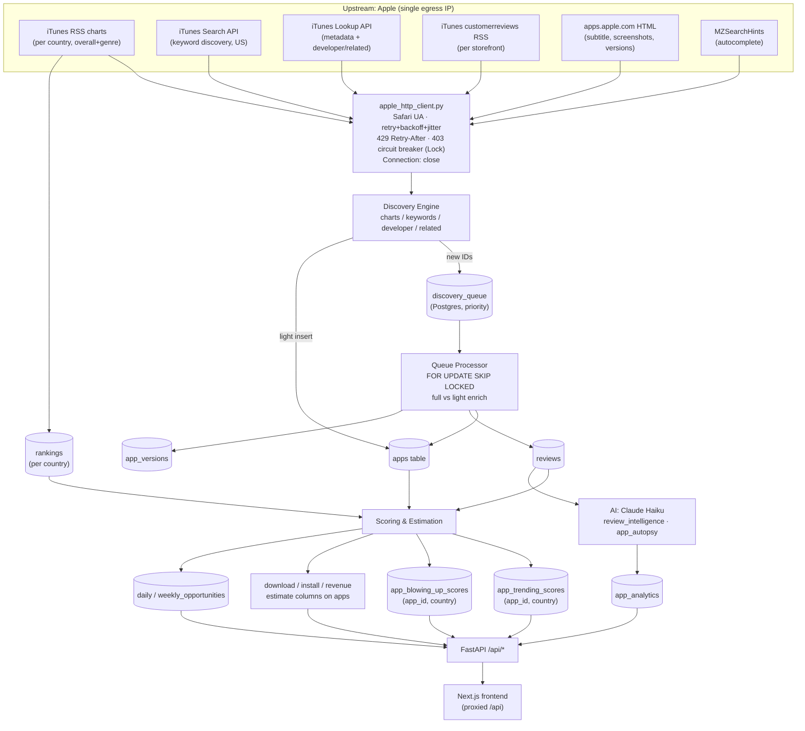

# 10 — Data Pipeline, Acquisition, Quality & AI Systems

> **Scope.** This document describes RankSpy's data engine exactly as implemented on the `audit-fixes` branch: how app data is discovered, acquired, scored/estimated, precomputed, and served, plus an honest assessment of coverage, data quality, and the (deliberately narrow) role of AI. Every claim below is traced to source files. Estimates produced by this system are **heuristic and unvalidated** — see §3.

**Legend:** ✅ solid / accurate-fresh · 🟡 partial / caveated · 🔴 weak / known gap

---

## 1. Data Pipeline (end-to-end)

The pipeline is a **single-egress-IP, queue-backed batch system** driven by APScheduler. There are no proxies; all Apple traffic exits one IP and is funnelled through one hardened HTTP client (`apple_http_client.py`).

### 1.1 Stages

| Stage | What happens | Key modules |
|---|---|---|
| **Discover** | Harvest candidate app IDs from four sources: per-country RSS charts (overall + genre), iTunes keyword search (US), developer expansion, related lookup. | `workers/discovery_engine.py` |
| **Queue** | New IDs deduped against `apps` + queue, inserted into `discovery_queue` (Postgres, `ON CONFLICT DO NOTHING`) with a priority (fresh apps jump ahead). A two-speed path also does `light_insert` directly into `apps`. | `discovery_engine.enqueue`, `light_insert_batch` |
| **Scrape** | Queue processor claims pending rows (`SELECT … FOR UPDATE SKIP LOCKED`), scrapes each app: **metadata via iTunes Lookup**, **reviews via RSS**, **version history via HTML page scrape**. Charts/rankings refreshed separately via RSS per country. | `scrapers/app_details.py`, `scrapers/appstore.py`, `services/review_scraper_service.py` |
| **Score / Estimate** | Precompute trending (per country), blowing-up (per country), download/revenue/install estimates, keyword scoring, opportunities. | `scoring/engine.py`, `services/*_estimator.py`, `keyword_scoring_v2.py`, `trending_compute_service.py`, `blowing_up_service.py` |
| **Precompute → Tables** | Results written to precomputed tables (`app_trending_scores`, `app_blowing_up_scores`, `daily/weekly_opportunities`, estimate columns on `apps`) so API reads are cheap table scans. | scheduler jobs |
| **API** | FastAPI serves precomputed rows; frontend proxies `/api/*`. | `api/routes.py` |

### 1.2 Flow diagram

### 1.3 Scheduler cadence (selected jobs)

From `workers/scheduler.py`:

| Job id | Interval | Purpose |
|---|---|---|
| `ranking_refresh` | 2 h | Chart RSS → `rankings` (fast, RSS only) |
| `country_charts` | 6 h | Per-country Tier-1 top charts |
| `discovery_charts` | 2 h | Charts → queue |
| `discovery_keywords` | 6 h | 286 keywords → queue |
| `discovery_developer` | 12 h | Developer expansion → queue |
| `queue_processor` | 30 min | Full/light scrape of queued IDs |
| `hourly_reviews_ratings` | 1 h | Quick reviews/ratings refresh |
| `review_scraper` | (scheduled) | Multi-country review ingestion |
| `trending_compute` | ~10 min | Precompute trending per country |
| `blowing_up_compute` | (scheduled) | Precompute blowing-up per country |
| `hourly_scoring`, `keyword_scoring`, `keyword_intelligence` | hourly/daily | Scores + keyword pipeline |
| `mass_discovery_light`, `enrich_hot/warm/cold`, `tier_reclassify` | staggered | Two-speed ingestion tiers |

---

## 2. Data Acquisition Strategy (as implemented)

### 2.1 Sources & endpoints

All Apple requests route through **`apple_http_client.apple_fetch` / `apple_fetch_json`**, which provides:

- **Realistic Safari UA** + `Accept`, `Accept-Language`, and `Connection: close` headers.
- **Retry with exponential backoff + jitter** (`2**attempt + random.uniform(0, 0.5)`) on 5xx.
- **429 guard**: honours `Retry-After` (parsed defensively, capped at 30 s).
- **403 handling**: no retry on 403; increments a **circuit breaker** guarded by `threading.Lock` — after **5 consecutive 403s** the breaker opens for **120 s**, during which all Apple calls short-circuit to `None`. Any success resets the counter.
- Circuit state is **module-level / process-scoped** (resets on restart).

> ⚠️ **One exception to the shared client:** `services/app_import_service.py` uses its **own `urllib` stack** (`_search_itunes`, its own `_APPLE_HEADERS`, `_TIMEOUT`) for the interactive "add app" search path. It is **not** governed by the shared retry logic or the 403 circuit breaker — a second, independent egress path to iTunes. 🟡

### 2.2 Collector → endpoint → country coverage

| Collector (code) | Upstream endpoint | Country coverage |
|---|---|---|
| Overall + genre charts — discovery (`_fetch_chart`) | `itunes.apple.com/{cc}/rss/{chart}/limit=200[/genre={id}]/json` — 3 charts × (all + 21 genres) | **20 countries** (`DISCOVERY_COUNTRIES`): us, gb, au, ca, de, fr, jp, kr, in, br, mx, es, it, nl, sg, se, za, ar, ru, cn |
| Charts — rankings/read (`appstore.AppStoreScraper._get_top_charts_sync`) | Same RSS pattern | Per-country (`country` arg); `_GENRE_IDS` = 21 genres |
| Keyword discovery (`_fetch_keyword*`) | `itunes.apple.com/search?entity=software&limit=200` | **US only** (`country=us` hardcoded) |
| Autocomplete (`apple_autocomplete_service`) | `search.itunes.apple.com/…/MZSearchHints…/hints` | `country` param (default us) |
| App metadata (`app_details.get_app_details`) | `itunes.apple.com/lookup?id=&country=&entity=software` | Per-app `country` (default us) |
| Reviews (`app_details.get_app_reviews`) | `itunes.apple.com/{cc}/rss/customerreviews/page={1..10}/id={id}/sortby=mostrecent/json` | Per storefront; **hard-capped at page 10 (~500 reviews)**, 0.5 s inter-page delay |
| Multi-country reviews (`review_scraper_service`) | Same reviews RSS | `countries` tuple; ≤5 apps concurrent (pool safety); top-N ranked apps only |
| Version history (`app_details.get_app_versions`) | `apps.apple.com/{cc}/app/id{id}` HTML → embedded JSON (`mostRecentVersion…shelves`) | Per-app `country`; BS4 fallback |
| Page metadata (`_scrape_page_metadata`) | Same HTML page | Subtitle + screenshots only (fills iTunes gaps) |
| Developer expansion (`_fetch_developer_apps`) | `itunes.apple.com/lookup?id={artistId}&entity=software` | Global (developer-scoped) |
| Interactive import (`app_import_service`, **own urllib**) | `itunes.apple.com/search`, `/lookup` | US |

### 2.3 Keyword discovery (US-centric)

- **`DISCOVERY_KEYWORDS` = 286 seed terms** spanning every major vertical (productivity, AI/tech, finance, health, education, entertainment, gaming niches, creator tools, wellness, etc.).
- **`MASS_KEYWORDS`** = seeds × 7 modifiers (`app, tracker, best, free, 2024, planner, tool`), deduped → ~2.2k long-tail terms for Phase-2 light discovery.
- **`ALL_GENRE_IDS` = 21 genres**; charts run as 3 charts × (all + 21 genres) × 20 countries.
- Keyword search is **hardcoded to `country=us`** — non-US discovery relies on charts + developer/related expansion only. 🟡

### 2.4 Chart rotation / SLA

`run_chart_discovery_batch` walks a **persistent rotating cursor** stored in `discovery_progress` (`chart:_cursor`). Combos are `chart → country → (all-genres, then each genre)`; each run processes `batch_size` combos not yet run today (`_ran_today` gating), then advances the cursor and wraps — so every combo is eventually reached instead of starving behind combo 0. This spreads the request budget across the single IP.

### 2.5 Single-IP constraint

The entire system egresses from **one IP with no proxy rotation**. The 403 circuit breaker (§2.1) is the primary defence: it trades throughput for not getting the IP blocked. Practical implication — acquisition is **rate-limited and sequential-ish** (bounded concurrency of 5 in review/queue paths, 0.2–0.5 s inter-request sleeps), which caps total daily catalog throughput. ✅ (robust) / 🟡 (throughput-limited)

---

## 3. Data Quality & Coverage Analysis

### 3.1 Coverage

| Aspect | Status | Notes |
|---|---|---|
| Discovery breadth | 🟡 | Four sources: charts (overall+genre, 20 countries), US keyword search, developer expansion, related lookup. |
| **No ID enumeration** | 🔴 | There is **no** sequential/space-filling app-ID crawl. An app is only discoverable if it (a) charts in a tracked country, (b) surfaces for a tracked **US** keyword, or (c) shares a developer with an already-known app. |
| **Catalog tail invisibility** | 🔴 | Apps that never chart, never rank for a tracked US keyword, and have no known-developer link are **invisible** to the system. |
| Non-US keyword coverage | 🟡 | Keyword search is US-only; other storefronts covered by charts/developer only. |
| Freshness bias | ✅ | Fresh apps (`release_date < 30d`) get queue priority 5, so new launches are prioritised. |

**Honest current-vs-potential coverage estimate.** The public iOS App Store is on the order of **~1.7–2M active apps**. RankSpy's addressable universe is bounded by: 3 charts × 22 genre-slices × 20 countries × ≤200 apps (with heavy overlap across genres/countries), plus ~286 US seed keywords × ≤200 results, plus their developer/related fan-out. After dedup this realistically reaches the **most visible / commercially relevant apps — plausibly tens of thousands to low-hundreds-of-thousands of distinct apps**, i.e. a **single-digit percentage of the full catalog** but a **much higher share of apps that actually chart or rank**. Because the long tail is structurally unreachable without ID enumeration, potential coverage under the current architecture is capped well below full-catalog. This is an **order-of-magnitude reasoning estimate, not a measured figure** — the code exposes a `coverage_pct` metric but it is computed as `apps / (queue + apps)` (queue-drain progress), **not** coverage of the true catalog, so it should not be read as market coverage. 🔴

### 3.2 Estimate accuracy

| Aspect | Status | Notes |
|---|---|---|
| Methodology | 🟡 | Downloads = 4-layer ensemble (rank curve, review velocity, keyword visibility, momentum) with confidence-weighted shrinkage; installs = review-count × category IR ratio × rank boost; revenue = installs × ARPU/conversion or price. All **heuristic**. |
| **Calibration** | 🔴 | **No ground-truth calibration.** `calibration_profiles` / category reliability weights are hand-set constants, not fitted to real download data. Confidence is a Bayesian-style product of heuristic factors, capped by a hardcoded ceiling (default 0.82). |
| **Rank-curve interpolation bug** | 🔴 | See below. |
| Anti-manipulation | ✅ | Per-category daily caps + review-velocity ceiling (500/day) guard against spam-inflated estimates. |
| Low-confidence handling | ✅ | If confidence < 0.20 the estimator returns `None` for all numeric fields ("Unavailable" in UI) rather than a misleading number. |

**Known `interpolate_rank_downloads` band-edge bug** (`config/rank_curves.py`). For a rank strictly inside a band the function:

1. Computes a log-linear position `t` (0 at band start → 1 at band end), then
2. Computes and **discards** several intermediate variables (`interp_lo`/`interp_hi` are identical; `band_lo`/`band_hi` are dead code), and
3. Returns `(midpoint - spread·(1-t), midpoint + spread·(1-t))`.

Because the returned half-width is `spread·(1-t)`, **as `t → 1` (rank approaching the high-numbered / lower-download edge of each band) the low and high bounds collapse to a single point (zero-width range)**, while the next band restarts at full width — producing a **discontinuity at band boundaries** and degenerate ranges near band edges. The midpoint blend also mixes `lo_dl/ratio` terms, so downloads are not guaranteed to decrease monotonically with worse rank. Downstream (`download_estimator._layer1_rank_curve`) only takes the **midpoint** `(lo+hi)/2`, which partially masks the collapsed-range symptom but inherits the non-monotonic/discontinuous midpoint. 🔴

### 3.3 Metadata completeness

| Field | Status | Notes |
|---|---|---|
| Name, developer, category, rating, review count, price, version | ✅ | From iTunes Lookup — reliable, fresh. |
| Subtitle, screenshots | 🟡 | Often missing from Lookup API → filled by fragile HTML/embedded-JSON page scrape (`_scrape_page_metadata`). |
| **Version history** | 🟡 | Scraped from `apps.apple.com` HTML via recursive `_find_key` on embedded JSON (path "varies by storefront"), with a BS4 selector fallback; falls back to a single synthesised version from iTunes `version` if scrape fails. Structurally fragile to Apple page redesigns. |
| **In-app purchase list** | 🔴 | Lookup's `inAppPurchasesCollection` is parsed if present but "not always present"; the `apps` table stores IAP as a **boolean** (`has_iap`), **not** an itemised IAP/price list. No SKU-level IAP data. |
| Ratings histogram / per-version ratings | 🔴 | Not collected. |

### 3.4 Deduplication

| Aspect | Status | Notes |
|---|---|---|
| App dedup | ✅ | `apps.app_id` unique; discovery dedups against `apps` + queue; inserts use `ON CONFLICT DO NOTHING`. |
| **Review dedup** | 🟡 | `reviews.review_id` is **globally UNIQUE** (single column, not `(app_id, storefront)`), relying entirely on Apple's globally-unique RSS review IDs. Multi-storefront reviews for one app coexist because Apple assigns distinct IDs per review; there is **no composite key**, so dedup is only as good as Apple's ID uniqueness. |
| Queue dedup | ✅ | `discovery_queue.app_id` unique + `ON CONFLICT DO NOTHING` (concurrent-safe). |

### 3.5 Retention

| Data | Status | Notes |
|---|---|---|
| `rankings` | 🔴 | **No retention/purge policy** — grows unbounded (compute windows read last 14 d, but rows are never deleted). |
| `reviews` | 🔴 | **No purge** — grows unbounded. |
| `metric_snapshots` | ✅ | 90-day retention with daily pruning (`metric_snapshot_service`). |
| Keywords | ✅ | Daily cleanup + quality pruning (`keyword_cleanup_daily`, `keyword_quality_pruning`) with a ~1M ceiling and Tier-C eviction. |

---

## 4. AI Systems (precise scope)

### 4.1 What actually uses Anthropic

Only **two services** call the Anthropic API anywhere in the backend (verified: `messages.create` appears solely in these files):

| Service | Purpose | Model | Client / limits |
|---|---|---|---|
| `services/review_intelligence.py` | Batch-analyse ≤80 negative reviews (rating ≤2, truncated to 300 chars each) → feature requests, competitor mentions, pricing complaints, pain points, opportunity score (JSON). | `claude-haiku-4-5-20251001` | **Sync** `anthropic.Anthropic(timeout=30.0)`, `max_tokens=1024`, lazy-imported, requires `ANTHROPIC_API_KEY`. |
| `services/app_autopsy.py` | Optional 3–5 sentence narrative "why is this app winning" over already-computed rule-based metrics. | `claude-haiku-4-5-20251001` | Sync client `timeout=30.0`, `max_tokens=400`; `use_llm` toggle; returns `None` if key missing. |

> The `"anthropic"` string in `config/scoring_config.py` is a **brand name in a big-brand-developer list**, not an API call.

**Caching / cost gating** 🟡

- **No Anthropic prompt caching** (no `cache_control`) is used; each call is a fresh completion.
- **Application-level result caching**: `review_intelligence` persists results to `AppAnalytics.common_complaints` and **skips re-running** unless `force=True` and cached data lacks the `feature_requests` key — this is the primary cost gate (avoids re-analysing the same app). `app_autopsy`'s narrative is generated on demand and gated by the `use_llm` flag + presence of the API key.
- Model is fixed to **Haiku** (cheapest tier) for both; no Sonnet/Opus usage.

### 4.2 What is explicitly **NOT** LLM (rule-based / statistical)

These are frequently assumed to be "AI" but are **deterministic code**, no model calls:

| System | Mechanism |
|---|---|
| **Opportunity generation** (`opportunity_*`, `weekly_opportunities`, `scoring/engine`) | Weighted heuristics over ranks/reviews/keywords. |
| **Trending scores** (`trending_compute_service`, per country) | Momentum (3d/7d), consistency, absolute-rank bonus, review momentum — arithmetic, per-country isolated. |
| **Blowing-up detection** (`blowing_up_service`, per country) | Normalised rank velocity, rank change, review velocity, chart presence, cross-market, incumbent penalty. |
| **Idea generation** (`scoring/idea_generator`) | Template/rule-based over aggregated gaps. |
| **Keyword scoring** (`keyword_scoring_v2`) | Volume/difficulty/chance/KEI via log-scaled fusion, HHI concentration, CTR tables — pure math. |
| **App autopsy strengths, momentum, cadence** | Rule-based (`_derive_strengths`); only the optional narrative is LLM. |
| **Download/install/revenue estimates** | Heuristic ensemble (§3.2). |

### 4.3 External data enrichment (non-Anthropic)

In `services/keyword_intelligence_pipeline.py`:

| Integration | Status | Notes |
|---|---|---|
| **Google Trends (`pytrends`)** | 🟡 optional | Interest-over-time for ≤5 keywords/call; lazy-imported, gated by `GOOGLE_TRENDS_ENABLED`; degrades gracefully if pytrends missing or Google blocks it. |
| **DataForSEO** | 🟡 optional | Real search volume / difficulty / CPC via `api.dataforseo.com/v3`; **off unless** `DATAFORSEO_ENABLED` + credentials set; **cost-gated** — only fetched for keywords with `opportunity_score ≥ 50` (`_DATAFORSEO_MIN_SCORE`). |
| **Apple autocomplete** | ✅ | Free popularity signal (MZSearchHints), feeds keyword volume scoring. |

---

## Summary of key risks

- 🔴 **No catalog-tail coverage** (no ID enumeration) and a `coverage_pct` metric that measures queue drain, not market coverage.
- 🔴 **Uncalibrated, heuristic estimates** with a concrete **band-edge interpolation bug** in `rank_curves.py`.
- 🔴 **No retention** on `rankings`/`reviews` (unbounded growth).
- 🟡 **Fragile HTML scrapes** for version history / subtitle / screenshots; **no itemised IAP** data.
- 🟡 **Single egress IP**, protected but throughput-limited; one non-shared urllib path in `app_import_service`.
- ✅ **AI footprint is small and honest**: two Claude Haiku callers (review intelligence + optional autopsy narrative), result-cached, cost-gated; everything else marketed as "insight" is deterministic scoring.
