# 12 — Roadmap (ROI-Prioritized)

> Part of the **RankSpy Project Bible**. See [INDEX.md](./INDEX.md). Ordered by **business impact / ROI**, not technical interest.

The guiding principle from the [CTO review](./04_CTO_REVIEW.md): **the gap to a lovable product is shipping + data quality, not features.** The roadmap reflects that — the earliest phases are almost entirely about getting live, measuring, and making the data trustworthy.

---

## Phase 0 — Before Production (must-do to go live safely)

**Goal: the current branch is live, safe, observable, and you can see your data quality.** Nothing here is a new feature.

| # | Item | Why | Effort |
|---|---|---|:--:|
| P0-1 | Push `audit-fixes`, open PR, **set up CI** (pytest + tsc + next build) | Ship safely; close live security holes | M |
| P0-2 | Railway **staging** environment; deploy branch there first | First migration + country pipeline run observed, not in prod | M |
| P0-3 | Deploy to prod; **watch the Alembic `0001→0005` boot** (verified safe, still watch) | Cutover | S |
| P0-4 | **Coverage/freshness metrics** (distinct apps by country/source, freshness, ranking rows/day) | See data quality | S–M |
| P0-5 | **Sentry** (backend + frontend) + alert on job-failure / 403-storm / migration-failure | Know when it breaks | S–M |
| P0-6 | Fix **usage-counter race** + Stripe **idempotency keys** | Stop revenue leak | S |
| P0-7 | Fix **rank-curve interpolation bug** | Stop obviously-wrong estimates | M |
| P0-8 | **Rankings/reviews retention + change-only writes** *before* widening country collection | Prevent storage blow-up | M |
| P0-9 | Fix/quarantine the **5 broken tests**; pin **Python 3.11** in CI | Green baseline | S |

**Exit criteria:** app is live on prod, migrations applied, Sentry green, coverage dashboard shows real numbers, estimates monotonic, no known revenue leak.

---

## Phase 1 — MVP (make the data *trustworthy* and let real users in)

**Goal: a small set of users can rely on the data for one job-to-be-done.** Depth over breadth.

| # | Item | Why | Effort |
|---|---|---|:--:|
| M-1 | **Spot-check accuracy** (20 apps × ranks/ratings/reviews vs live App Store) weekly; fix parsing gaps | Prove/repair correctness | M (ongoing) |
| M-2 | **Estimate calibration** (rank→downloads per country×category vs ground truth) + confidence UI | The core value | L |
| M-3 | **Proxy pool** + keep-alive client + per-IP breaker | Widen coverage past single-IP ceiling | M |
| M-4 | Let the **country charts + reviews actually run wide** (T1→T3) once retention + proxies exist | Real global data | S (config) |
| M-5 | **Cascade deletes** + user-delete cancels Stripe | Compliance/billing | M |
| M-6 | **Error-state UX** (stop rendering failures as empty) + **onboarding/empty states** | Activation/trust | M |
| M-7 | Pick a **focus niche** (one country or category) and make its data undeniably best | Wedge vs Sensor Tower | — (strategy) |
| M-8 | Get **1–3 real users**; instrument what they actually look at | Learn what "love" means | — |

**Exit criteria:** for the focus niche, the data visibly matches reality and estimates carry honest confidence; a real user returns weekly.

---

## Phase 2 — V1 (a credible commercial product)

**Goal: breadth + polish worth paying for across markets.**

| # | Item | Why | Effort |
|---|---|---|:--:|
| V1-1 | **Keywords per country** (localized seeds, per-market ranks, UI) | Completes global for ASO persona | L–XL |
| V1-2 | **App-ID enumeration / sitemap ingestion** | Cover the catalog tail (turn "chart tracker" into "catalog tracker") | M |
| V1-3 | **Batched `/lookup` change-detection** refresh (200 ids/call) + tiered app refresh | Cheap freshness at scale | M |
| V1-4 | **Frontend data layer** (SWR/react-query): cache, dedup, retry, kill fetch races | UX + reliability in one move | M |
| V1-5 | **Consolidate scoring formulas** + shared app-upsert; remove dead code | Consistency/maintainability | M |
| V1-6 | Country selector on **remaining pages** (apps list rank view, opportunities) | Consistency | M |
| V1-7 | **Exports** (CSV/API) + **watchlists/alerts** polish | Retention/stickiness | M |
| V1-8 | Split `apps/[id]/page.tsx` + lazy-load; `next/image` | Perf/bundle | M |

**Exit criteria:** paying users across ≥3 markets; ASO + market-research jobs both served with trustworthy data.

---

## Phase 3 — V2 (scale the acquisition engine)

**Goal: near-real-time for top markets, full depth for the long tail — the Discovery Engine V2 already designed.**

| # | Item | Why | Effort |
|---|---|---|:--:|
| V2-1 | **Dedicated worker service** (lift scheduler drainers out of the web process) | Horizontal scaling | L |
| V2-2 | **Tiered request-budget lanes + AIMD governor** (discovery never starves refresh, and vice versa) | Fair, adaptive acquisition | L |
| V2-3 | **Proxy fleet + regional worker shards** | Throughput | L |
| V2-4 | **Partitioned Postgres + rollups + read replica** | Storage/query scale | L |
| V2-5 | **Per-country sentiment rollups** (app_analytics country dimension) | Deeper review intelligence | M |
| V2-6 | **AMP catalog/reviews API** (structured version history, dev replies, deeper reviews) | Metadata/review quality | M |

**Exit criteria:** all 175 storefronts covered at tier cadence; T1 near-real-time; margins stable.

---

## Phase 4 — Long-term Vision

| Theme | Idea | State |
|---|---|---|
| Ground-truth data | Panel/SDK or purchased install data to anchor estimates → best-in-class accuracy | 🔴 |
| Android / Google Play | Second platform → doubles TAM | 🔴 |
| Predictive intelligence | Forecast rank/trend trajectories; "which apps will blow up next" | 🟡 (heuristics exist) |
| API product | Sell the data via API (the durable-queue + Postgres design supports it) | 🔴 |
| Team features | Multi-seat, shared watchlists, roles (workspace model already exists) | 🟡 |
| Ad intelligence at scale | Real creative/spend intelligence (currently heuristic) | 🔴 |

---

## Roadmap at a glance

```mermaid
gantt
  title RankSpy ROI-ordered roadmap
  dateFormat  X
  axisFormat %s
  section P0 Before Prod
  Ship + CI + staging      :0, 3
  Metrics + Sentry         :1, 3
  Fix estimates + retention:2, 4
  section MVP
  Accuracy + calibration   :4, 8
  Proxies + wide collect   :5, 8
  1-3 real users           :6, 9
  section V1
  Keywords per country     :8, 12
  Catalog enumeration      :9, 12
  Frontend cache layer     :9, 11
  section V2
  Worker service + budget  :12, 18
  Proxy fleet + partition  :14, 20
```

The single most important arrow: **P0 before anything else.** Every later phase assumes the product is live and its data quality is visible.
